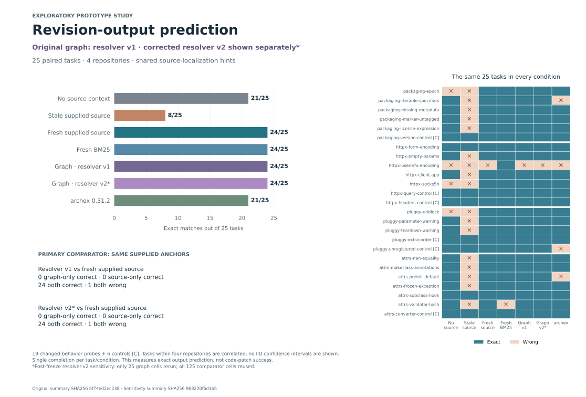

# Agent Code Evidence · 智能体代码证据校验

Previously `contextproof`. Package and command names remain unchanged (`contextproof`). 仓库原名 `contextproof`，包名及现有命令保持不变。

[](https://github.com/hardwork-xu/agent-code-evidence/actions/workflows/ci.yml)
[](LICENSE)

**Versioned source evidence for coding agents.**

When a repository changes, a saved caller can still look identical while its
dependencies have changed. ContextProof records the source and supported Python
references behind that caller, explains which recorded dependency changed, and
delivers current source within a measured context allowance.

The graph workflow adds immutable Git snapshots, bounded transitive dependency
evidence, verified graph deltas and MCP handles. Full evidence stays in the local
store; the model receives a separately budgeted source payload. Dynamic dispatch,
ambiguous symbols, unsupported references and missing source remain explicit.

Python 3.11+, macOS/Linux. The core has no third-party runtime dependencies and
requires no model, GPU or API key. Hosted-model experiments are separate.

[简体中文](docs/README.zh-CN.md) · [Graph API and contracts](docs/GRAPH.md) ·
[Measured report](docs/GRAPH_REPORT.md) · [Model protocol](docs/REVISION_STUDY_PROTOCOL.md)

## Run the three-hop example

```sh
git clone https://github.com/hardwork-xu/agent-code-evidence.git
cd agent-code-evidence
python3 -m venv .venv
source .venv/bin/activate
python -m pip install -e .
python scripts/demo_graph.py
```

Open `docs/assets/graph-demo.html` locally. This clearly labeled synthetic
demonstration creates real Git commits, changes a third-hop dependency from
`0.05` to `0.20`, and runs the actual implementation. It checks that the changed
source reaches the model payload, the delta exactly reconstructs the current
graph, unrelated changes can retain evidence, and insufficient budgets or unknown
references remain incomplete. Fixture code is inspected, never executed.

## Use it with a repository

Replace `REPOSITORY`, `BEFORE_COMMIT` and `AFTER_COMMIT` with real values:

```sh
contextproof graph-capture REPOSITORY "invoice_total" \
  --ref BEFORE_COMMIT --budget 16000 \
  --output work/before.json --payload work/before-context.json

contextproof graph-refresh REPOSITORY work/before.json \
  --ref AFTER_COMMIT --view full --budget 16000 \
  --output work/after.json --payload work/current-context.json \
  --delta work/change.json

contextproof graph-apply work/before.json work/change.json \
  --output work/reconstructed.json
```

Use `--view update` when retaining the identified base context. An update is not
standalone full context. Commands save full artifacts separately; **only the
payload file is the bounded model message**. Exit `1` means incomplete delivery,
which can still contain useful source; exit `2` is an input or operation error.
Omitting `--ref` scans and hashes the working tree without promising an atomic
filesystem snapshot. Immutable Git reads never fetch missing objects or execute
repository code.

## What is checked

| Contract | Evidence | Limit |
|---|---|---|
| Source identity | Exact text, path, declaration and recorded fingerprint | No semantic-equivalence or authorship proof |
| Static dependency evidence | Supported definitions, import bindings, cycles and bounded transitive paths | Unresolved or truncated frontiers prevent freshness |
| Model delivery | All UTF-8 bytes of source, citations, metadata and summarized diagnostics | Whole declarations may not fit; complete delivery is not task sufficiency |
| Graph delta | Named base, field edits, target seal and exact reconstruction | Storage/transport savings do not imply fewer model tokens |

Nodes have stable path/symbol/kind identities and separate source fingerprints.
Line movement can change citations without retransmitting unchanged source text.
ASTs are reused in memory across MCP requests; source hashes and resolution
catalogs are checked again. Optional disk AST persistence remains available for
measurement, but is not the default after a fair timing comparison found overhead.

The existing exact-span `bundle/verify/repair` workflow and v1 direct-witness
`capture/check/refresh` APIs remain available. The latter's source-only rendering
does not guarantee delivery of a changed dependency; use the graph workflow when
the model needs that dependency's code. Historical evaluations remain unchanged.

## MCP

Use [examples/mcp.json](examples/mcp.json) with a fixed absolute repository root.
`contextproof serve ROOT` exposes ten tools. The graph pair is:

- `contextproof_graph_capture`: choose anchors, save the full graph locally and return bounded source plus its handle.
- `contextproof_graph_refresh`: read that handle and return current full/update source with explicit coverage.

Their complete returned text is charged to `budget` in UTF-8 bytes. Tool schemas
and outer conversation framing are not part of that string; actual experiment
token usage is recorded separately. Legacy tool sidecars have a different budget
contract, documented in the [v1 report](docs/TECHNICAL_REPORT.md).

## Evidence, including negative results

The [graph replay](benchmarks/graph/README.md) measures exact reconstruction,
additional transitive observations, delivery failures and fair cache baselines.
It preserves the initial renderer's metadata-overflow failures and the slower
persistent-cache design. A lexical-scope correctness review also triggered a
versioned resolver correction; original artifacts are retained.

The [real revision study](docs/REVISION_STUDY_PROTOCOL.md) freezes 30 upstream-derived
API probes from four libraries, with 5 development and 25 held-out tasks. It
compares six source conditions under a 16,000-byte cap, including a same-anchor
source baseline and actual Archex 0.31.2. A capable-model gate passed 5/5 before
held-out inference. The public protocol and inputs precede those completions.
This is source-conditioned output prediction with supplied localization hints.

The frozen 150-completion comparison scores **8/25 with stale source and 24/25
with graph context, fresh supplied declarations or BM25**; Archex scores 21/25.
The graph ties the simpler same-anchor baseline and uses more input tokens.
These results motivate version tracking and auditable refresh. A separate
25-completion resolver-v2 sensitivity produces the same 24/25 answers; the original
150 records remain available. [Full paired results and correction history](docs/GRAPH_REPORT.md).



Earlier results remain public: [300 exact-text drift cases](docs/DRIFT_STUDY.md),
[34 direct-dependency controls](docs/DEPENDENCIES.md), and a
[60-generation Qwen study with 0/20 in every condition](docs/DOWNSTREAM.md).
Neither contract agreement nor a smaller artifact establishes model effectiveness.

## Reproduce and contribute

```sh
python -m pip install -e '.[dev]'
ruff check .
pytest -q tests benchmarks/graph/test_scope_audit.py benchmarks/revision_baselines/test_baselines.py
python scripts/check_publication.py
python -m build
```

For official MCP SDK interoperability, install `.[integration]` and run
`python scripts/check_mcp_sdk.py`. Benchmark commands and frozen inputs are linked
from their reports; CI does not invoke hosted models.

[Related work](docs/RESEARCH.md) · [Security](SECURITY.md) ·
[Publication/privacy policy](docs/PUBLISHING.md) · [Development log](docs/DEVELOPMENT_LOG.md)

Maintained by **hardwork-xu**, with AI assistance for design, implementation,
experiments and writing. The project claims no new retrieval algorithm or
published research result. Source and evaluation records are public; personal
plans, account data and raw local diagnostics are kept outside Git.
