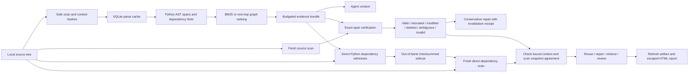

# System design

## Index and retrieval

Source is read as UTF-8 without newline normalization. Every file gets a SHA-256
digest; the snapshot identity covers paths, content digests, and index settings.
SQLite caches parsing by content hash. Every scan still reads eligible bytes:
warm indexing avoids reparsing, not filesystem I/O. Added and removed files alter
the snapshot and graph. The cache is disposable.

Python source is partitioned by its innermost class/function scope, with decorator
lines and a maximum of 80 lines per chunk. Long definitions can span multiple
chunks. Other supported languages and malformed Python use fixed line windows;
only Python has structural parsing and dependency analysis in v1.0.

Ranking uses BM25 with fixed `k1=1.2`, `b=0.75`, identifier splitting, path terms,
and doubled symbol terms. Graph mode adds 15% of the strongest directly connected
lexical file score. The graph comes from static imports and unique symbol-name
references. It is a heuristic, not a resolved call graph. Both methods share the
same chunker, lexical prior, and packer. All weights are fixed before reporting.

The greedy packer considers ranked chunks and skips chunks that do not fit. It
never truncates source text to make a budget. This is not optimal knapsack solving.
An empty result is explicit and cannot verify as sufficient evidence.

## Evidence contract

A schema-v1 bundle records query, retrieval method, snapshot identity, budget
unit, budget, consumed allowance, source entries, and an integrity checksum.
Entries carry path, inclusive line range, original text, text digest, whole-file
digest, symbol hint, score, and ranking reasons. Paths are repository-relative.

| Status | Meaning | Repair |
|---|---|---|
| `valid` | Original text still occupies the recorded lines | Retain and refresh file digest |
| `relocated` | Old location differs; exactly one whole-line exact match exists | Update path and lines |
| `modified` | Old file exists but the old text is absent from the eligible corpus | Invalidate |
| `deleted` | Old path and old text are absent | Invalidate |
| `ambiguous` | More than one relocation candidate matches exactly | Invalidate |
| `invalid` | Malformed evidence, integrity failure, or unsafe/unreadable source | Invalidate or reject malformed bundle |

An unchanged original location wins even if an identical copy exists elsewhere.
`relocated` describes text matching, not proof of historical code movement. A
modified original and an unrelated unique same-text copy remain a semantic
ambiguity that exact text alone cannot resolve. The verifier makes no identity
or semantic guarantee beyond the stated text predicate.

Verification succeeds only when every entry is `valid` at its original location.
Run repair for unique relocations, then verify the resulting bundle. Repair keeps
only exact entries; it does not replace changed code by the nearest symbol. It
records the previous bundle and snapshot, invalidated entries, and budget drops.
To obtain newly changed code, issue a new retrieval query and inspect it.

## Dependency sidecar and context workflow

A schema-v1 context artifact wraps the source bundle and a separate dependency
sidecar. Its checksum covers both. The sidecar records the source bundle ID,
capture snapshot ID and one anchor for every source entry. Context validation
requires a one-to-one match of entry IDs and all anchor source fields; missing,
extra, duplicated or substituted anchors cannot authorize reuse, even if wrapper
checksums have been recomputed.

Dependency witnesses use a separate Python AST resolver, not the retrieval
graph's ranking hints. Supported references include unique module-level
definitions, literal constants and explicit repository import bindings, including
aliases and re-exports. The witness contains the complete directly referenced
declaration and import-chain text. A helper or import target can change while a
selected caller remains byte-identical; that caller's source report can be
`valid` while its dependency report is `changed`.

Dependency statuses are `unchanged`, `changed`, `missing`, `unresolved` and
`invalid`. Dynamic calls, external/builtin references, ambiguous bindings and
unsupported languages remain unresolved. The scope is one hop: a changed
grandchild, runtime state, monkeypatching or an environment change is outside
the guarantee. See [DEPENDENCIES.md](DEPENDENCIES.md) for the complete contract.

`capture` builds a current bundle and witnesses its exact capture snapshot.
`check` independently verifies source and dependencies, requires the two current
scan snapshot IDs to agree, and produces a recommendation:

| Recommendation | Condition |
| --- | --- |
| `reuse` | Every source entry is valid, all captured dependencies are unchanged, and current scan snapshots agree. |
| `repair` | Every source entry is valid or uniquely relocated, dependencies are unchanged, and current scan snapshots agree. |
| `review` | Source is valid but automatic reuse is withheld, for example because resolution is incomplete or scan snapshots differ. |
| `retrieve` | Current evidence cannot support reuse or conservative repair under the checks above. |

`refresh` performs conservative repair when permitted and otherwise retrieves
again using the saved query, method, tokenizer and budget. If repair metadata
leaves no room for source, it falls back to retrieval. It captures new witnesses
and preserves the previous assessment in a refresh receipt. A refreshed artifact
can still contain unresolved dependencies; refresh is not a runtime resolver.

## Budget accounting

The default unit is **UTF-8 bytes**. This is a conservative upper bound on ordinary
byte-BPE text tokens, not a model token estimate. Optional `cl100k_base` and
`o200k_base` use tiktoken. No model call or API key is needed; first use may fetch
the encoding table.

The budget applies to `render_bundle(bundle)`, including serialized metadata,
citations, code, and delimiters. Send this rendered payload to an agent. The full
JSON storage artifact, dependency sidecar, context wrapper, MCP JSON wrapper,
HTML report, repair/refresh receipts, and other conversation messages are outside
that budget. The derived consumed field is kept in the
storage receipt and excluded from rendering to avoid a self-referential count;
consumed is the exact byte or configured tokenizer count of the rendered payload.

## Consistency and limits

The verifiers scan current source rather than trusting the cached index. Each
dependency operation scans eligible source once and parses each Python file at
most once. `check` requires equality of source and dependency scan snapshot IDs
before allowing reuse or repair. This detects differing scan results; it does
not make either scan atomic or lock the filesystem. Use a quiescent tree or
immutable checkout when consistency matters, and check again after edits.

Hashes detect alteration without establishing authenticity: someone controlling
both an artifact and its checksums can replace both. Structural anchor binding
prevents contradictory source/sidecar combinations, but is not a signature.
Neither exact-text verification nor direct dependency witnesses prove behavior,
transitive freshness, or completeness.

v1.0 targets POSIX macOS/Linux, Python 3.11+. It does not interpret `.gitignore`;
the fixed exclusions and size limit are in `index.py`. The parser does not execute
source or resolve runtime imports. It has no semantic model, embedding index,
GPU requirement, or paid service dependency. Those statements describe the core
package. The separately invoked [downstream research harness](../scripts/run_downstream.py)
uses an optional local model and executes generated candidates and frozen tests
inside macOS Seatbelt with resource limits. It verifies the sandbox before
evaluation and refuses to run without it; there is no unsandboxed fallback.
That experiment is not exposed through the CLI's core source operations or MCP
tools and is not required to install or use ContextProof.

## Interfaces

The CLI emits JSON by default; `bundle` and `repair` accept `--format markdown`.
`capture`, `check` and `refresh` operate on combined context artifacts. `report`
produces a self-contained HTML report with escaped source and metadata, local
filters and no external asset requests. Store JSON for later verification and
use `render` on either a source bundle or context artifact for the bounded agent
payload. Exit codes: 0 success, 1 verification/check does not authorize validity
or reuse, 2 input/operation error.

`contextproof serve ROOT` exposes eight fixed-root MCP tools over newline-delimited
JSON-RPC stdio: index, search, bundle, verify, repair, capture, check and refresh
(each prefixed `contextproof_`). The implementation supports
initialization, ping, listing and calling tools. It does not implement HTTP,
resources, sampling, prompts, or elicitation. See the [MCP transport specification](https://modelcontextprotocol.io/specification/2025-11-25/basic/transports)
and [lifecycle](https://modelcontextprotocol.io/specification/2025-11-25/basic/lifecycle).
The generic client configuration is in `examples/mcp.json`.
