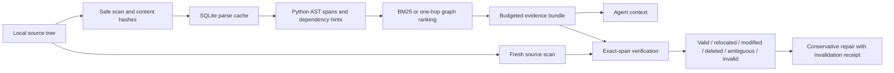

# System design

## Index and retrieval

Source is read as UTF-8 without newline normalization. Every file gets a SHA-256
digest; the snapshot identity covers paths, content digests, and index settings.
SQLite caches parsing by content hash. Every scan still reads eligible bytes:
warm indexing avoids reparsing, not filesystem I/O. Added and removed files alter
the snapshot and graph. The cache is disposable.

Python source is partitioned by its innermost class/function scope, with decorator
lines and a maximum of 80 lines per chunk. Long definitions can span multiple
chunks. Other supported languages and malformed Python use fixed line windows;
only Python has structural parsing and dependency analysis in v0.1.

Ranking uses BM25 with fixed `k1=1.2`, `b=0.75`, identifier splitting, path terms,
and doubled symbol terms. Graph mode adds 15% of the strongest directly connected
lexical file score. The graph comes from static imports and unique symbol-name
references. It is a heuristic, not a resolved call graph. Both methods share the
same chunker, lexical prior, and packer. All weights are fixed before reporting.

The greedy packer considers ranked chunks and skips chunks that do not fit. It
never truncates source text to make a budget. This is not optimal knapsack solving.
An empty result is explicit and cannot verify as sufficient evidence.

## Evidence contract

A schema-v1 bundle records query, retrieval method, snapshot identity, budget
unit, budget, consumed allowance, source entries, and an integrity checksum.
Entries carry path, inclusive line range, original text, text digest, whole-file
digest, symbol hint, score, and ranking reasons. Paths are repository-relative.

| Status | Meaning | Repair |
|---|---|---|
| `valid` | Original text still occupies the recorded lines | Retain and refresh file digest |
| `relocated` | Old location differs; exactly one whole-line exact match exists | Update path and lines |
| `modified` | Old file exists but the old text is absent from the eligible corpus | Invalidate |
| `deleted` | Old path and old text are absent | Invalidate |
| `ambiguous` | More than one relocation candidate matches exactly | Invalidate |
| `invalid` | Malformed evidence, integrity failure, or unsafe/unreadable source | Invalidate or reject malformed bundle |

An unchanged original location wins even if an identical copy exists elsewhere.
`relocated` describes text matching, not proof of historical code movement. A
modified original and an unrelated unique same-text copy remain a semantic
ambiguity that exact text alone cannot resolve. The verifier makes no identity
or semantic guarantee beyond the stated text predicate.

Verification succeeds only when every entry is `valid` at its original location.
Run repair for unique relocations, then verify the resulting bundle. Repair keeps
only exact entries; it does not replace changed code by the nearest symbol. It
records the previous bundle and snapshot, invalidated entries, and budget drops.
To obtain newly changed code, issue a new retrieval query and inspect it.

## Budget accounting

The default unit is **UTF-8 bytes**. This is a conservative upper bound on ordinary
byte-BPE text tokens, not a model token estimate. Optional `cl100k_base` and
`o200k_base` use tiktoken. No model call or API key is needed; first use may fetch
the encoding table.

The budget applies to `render_bundle(bundle)`, including serialized metadata,
citations, code, and delimiters. Send this rendered payload to an agent. The full
JSON storage artifact, MCP JSON wrapper, repair receipt, and other conversation
messages are outside that budget. The derived consumed field is kept in the
storage receipt and excluded from rendering to avoid a self-referential count;
consumed is the exact byte or configured tokenizer count of the rendered payload.

## Consistency and limits

The verifier scans current source rather than trusting the cached index. Hashes
detect accidental alteration, not malicious replacement of both text and hashes.
Verification is not a filesystem transaction; use a quiescent tree or immutable
checkout when consistency matters. Unchanged snippets may call changed functions
or depend on changed configuration. Such dependency freshness is an explicit
future research problem.

v0.1 targets POSIX macOS/Linux, Python 3.11+. It does not interpret `.gitignore`;
the fixed exclusions and size limit are in `index.py`. The parser does not execute
source or resolve runtime imports. It has no semantic model, embedding index,
GPU requirement, or paid service dependency.

## Interfaces

The CLI emits JSON by default; `bundle` and `repair` accept `--format markdown`.
Store JSON for later verification and use `render` for the bounded agent payload.
Exit codes: 0 success, 1 evidence no longer entirely valid, 2 input/operation error.

`contextproof serve ROOT` exposes five fixed-root MCP tools over newline-delimited
JSON-RPC stdio: index, search, bundle, verify, repair. The implementation supports
initialization, ping, listing and calling tools. It does not implement HTTP,
resources, sampling, prompts, or elicitation. See the [MCP transport specification](https://modelcontextprotocol.io/specification/2025-11-25/basic/transports)
and [lifecycle](https://modelcontextprotocol.io/specification/2025-11-25/basic/lifecycle).
The generic client configuration is in `examples/mcp.json`.
