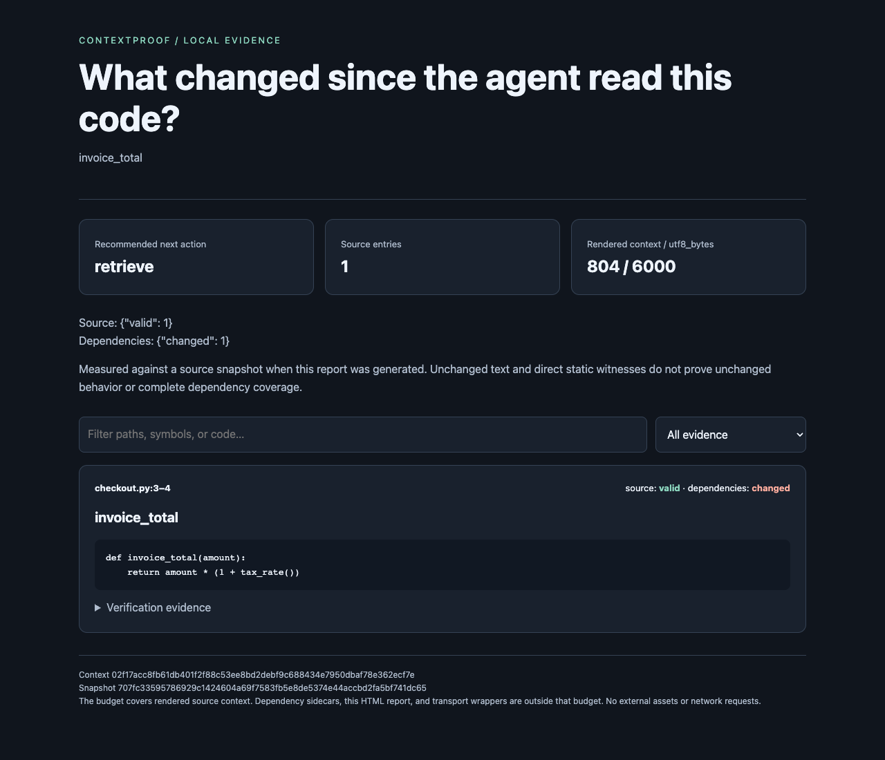

# ContextProof：检查 AI 保存的代码证据是否仍然可用

[English](../README.md) · [技术报告](TECHNICAL_REPORT.md) ·
[公开仓库](https://github.com/hardwork-xu/contextproof) · [评估协议](EVALUATION.md)

ContextProof 为编程助手保存代码片段、引用位置、源码哈希和直接依赖证据。
代码库变化后，它检查旧片段，修复唯一的精确文本迁移，报告依赖变化或无法
解析的引用，并给出可以检查的重新检索建议。

**v1.0 已实现完整工作流**：Python 包、CLI、8 个 MCP 工具、离线 HTML 报告，
以及完成运行并公开记录的实验。默认安装只用 Python 标准库，支持 Python 3.11+
和 macOS/Linux，日常使用不需要模型、GPU 或付费 API。



## 先运行一个完整示例

从 GitHub 安装；当前没有发布到 PyPI。

```sh
git clone https://github.com/hardwork-xu/contextproof.git
cd contextproof
python3 -m venv .venv
source .venv/bin/activate
python -m pip install -e .
python scripts/demo.py
```

用浏览器打开 `work/demo/02-changed.html`。示例只改变计算税率的辅助函数，
`invoice_total()` 的文本仍然相同。普通片段验证继续有效，依赖证据发现变化，
刷新后重新捕获当前源码。三个报告展示 **可复用 → 重新检索 → 可复用**。

在自己的代码库上使用相同流程：

```sh
contextproof capture work/demo/repository "invoice_total" \
  --budget 6000 --output work/context.json
contextproof check work/demo/repository work/context.json
contextproof report work/demo/repository work/context.json --output work/context.html

# 代码变化后，刷新证据并生成交给模型的正文。
contextproof refresh work/demo/repository work/context.json --output work/refreshed.json
contextproof render work/refreshed.json --output work/model-context.md
```

`capture` 保存绑定在一起的源码包和依赖旁路记录；`check` 返回 `reuse`、
`repair`、`review` 或 `retrieve` 建议。`refresh` 在源码与依赖两层条件允许时
修复引用，否则按原查询和预算重新检索。动态依赖无法解析时，刷新后仍可能
需要人工检查。`work/` 中的输出应放在被索引源码目录之外。

源码层面的 `index/search/bundle/verify/repair/render` 命令继续可用。
退出码 `0` 表示操作成功，`1` 表示 `verify` 未全部有效或 `check` 不可直接
复用，`2` 表示输入或操作错误。完整参数见 `contextproof --help`。

## 三层契约分别证明什么

| 层次 | 实际检查 | 明确边界 |
| --- | --- | --- |
| 源码证据 | 原位置的精确文本；唯一完整行匹配的迁移 | 文本一致不等于行为一致；哈希不是数字签名 |
| 直接依赖 | 支持静态解析的 Python 定义、常量和导入绑定 | 只检查一跳；动态、外部或歧义引用保留为 unresolved |
| 上下文工作流 | 源码包与依赖记录的身份绑定及复用建议 | 重新检索不会自动解决所有运行时依赖问题 |

源码状态包括有效、迁移、修改、删除、歧义和无效。修复只保留可以精确确认的
证据，不会用修改后的代码冒充原片段。依赖状态包括未变、变化、缺失、无法
解析和无效；**无法解析不会被当作新鲜证据**。完整细节见[系统设计](DESIGN.md)
与[依赖契约](DEPENDENCIES.md)。

检索实现包含 Python AST 切块、BM25、简单图扩展和 SQLite 增量解析缓存。
缓存命中仍需读取并计算文件哈希。源码扫描不会导入或执行被检查的仓库；
多个文件的验证过程也不提供原子快照保证。

## 预算与 MCP 接入

`--budget 6000` 默认表示 **6,000 个 UTF-8 字节**。统计范围是完整渲染的源码
正文，包含查询、引用、代码、元数据和分隔符；放不下的整块代码会被省略。
**依赖旁路记录、HTML 报告、JSON 存储回执、MCP 外层封装和其他消息不在该预算内。**
如果一并交给模型，需要另外计算它们的开销。

可选安装 `.[tokens]` 后，可指定 `cl100k_base` 或 `o200k_base` 编码；首次
使用可能下载编码表。编码 token 数不等于所有模型的 token 数或计费数量。

按照 [examples/mcp.json](../examples/mcp.json) 配置客户端，将根目录替换为
源码仓库的绝对路径。`contextproof serve ROOT` 通过 stdio 提供 8 个工具：
`contextproof_index`、`contextproof_search`、`contextproof_bundle`、
`contextproof_verify`、`contextproof_repair`、`contextproof_capture`、
`contextproof_check` 和 `contextproof_refresh`。每个服务固定一个源码根目录。

## 已完成的实验与结果

| 实验 | 结果 | 应如何理解 |
| --- | --- | --- |
| [真实版本漂移](../benchmarks/v1/results/latest.md) | 10 个仓库、300 个样本，与单独实现的参考程序 300/300 一致 | 限定源码范围内的契约一致性，不是人工标注准确率 |
| [源码范围敏感性](../benchmarks/v1/results/scope-sensitivity.md) | 扩大范围后，23 个 dateutil 样本从 deleted 变为 relocated | 这些代码移出了原语料边界，并未从上游仓库删除 |
| [盲态 AI 复核](../benchmarks/v1/review_comparison.json) | 选定的 21 个样本全部一致 | AI 复核，不是独立人工标注 |
| [依赖受控实验](../benchmarks/results/dependencies.md) | 34/34 符合预定状态；12 个过时案例和 12 个 unresolved 案例均未被接受为新鲜 | 检查已声明的规则，并记录额外耗时与体积 |
| [真实模型编程实验](DOWNSTREAM.md) | 20 个改编任务 × 3 种策略；**三组均为 0/20** | 没有证明下游任务成功率提升 |

下游实验固定 Qwen2.5-Coder-1.5B 本地模型、提示、预算和每格一次尝试，公开
全部 60 次输出及执行结果。54 次输出虚构了不存在的 `repository_helper` 模块。
随后用正确算法验证执行框架：当前 API 对照 20/20 通过，旧 API 对照只有
5 个未变化任务通过。任务可以完成，但这次模型没有完成；没有重新提示、
替换模型或挑选更好的结果。

[技术报告](TECHNICAL_REPORT.md) 汇总问题、方法、对照、留出划分、统计限制、
开销与失败分析。此前三个 Pallets 仓库上的 118 条漂移观察和 84 次检索实验
仍保留为[早期探索结果](EVALUATION.md)，没有被混入新的主实验。

## 复现

```sh
python -m pip install -e '.[dev]'
ruff check .
pytest -q
python -m build
python scripts/run_drift_benchmarks.py --download
python scripts/run_drift_benchmarks.py \
  --check benchmarks/v1/results/latest.json --output work/drift-replay
python scripts/run_dependency_benchmarks.py --repeats 7 --output work/dependencies.json
```

更多操作见[漂移协议](DRIFT_STUDY.md)、[依赖实验](DEPENDENCIES.md)、
[下游模型与隔离重放](DOWNSTREAM.md)。GitHub 首页 CI 标记链接当前验证结果；
模型生成实验与普通 CI 分开复现。

[完成矩阵](ROADMAP.md)列出交付物及证据；[开发记录](DEVELOPMENT_LOG.md)记录
实际完成的工作。

项目由 **hardwork-xu 维护，使用 AI 辅助设计、实现、实验与写作**。
项目采用 [MIT 许可证](../LICENSE)，
实验来源与上游许可证保存在各实验 manifest 中。
